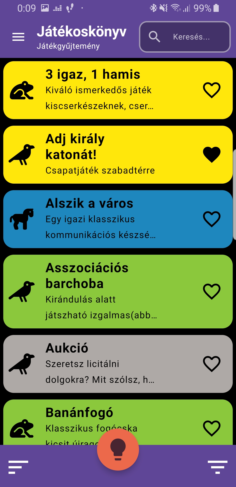
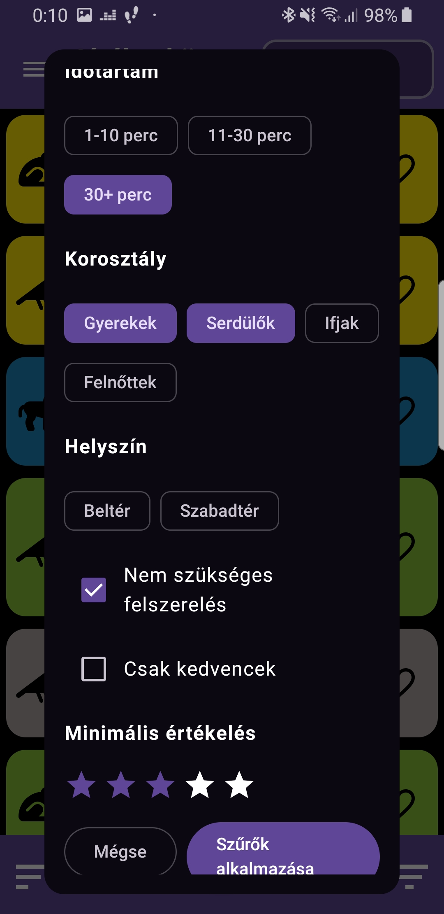
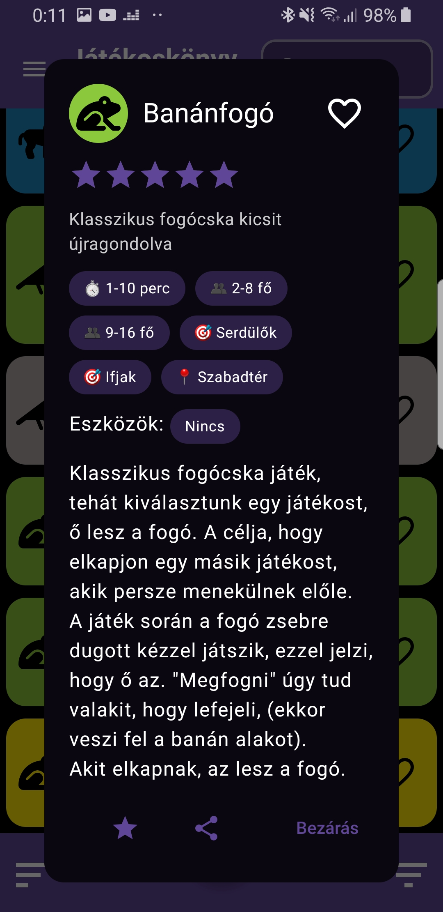
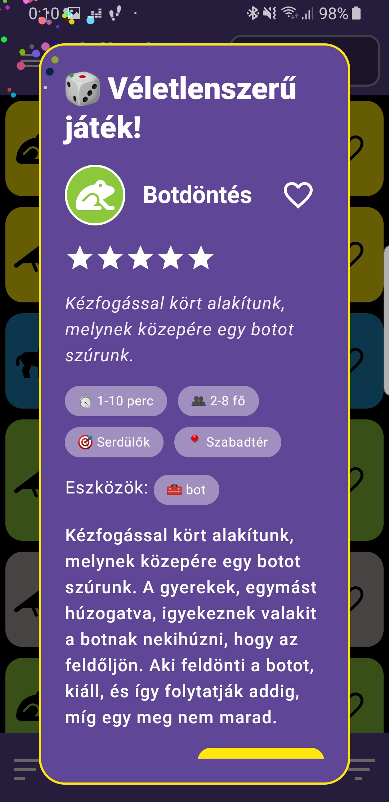
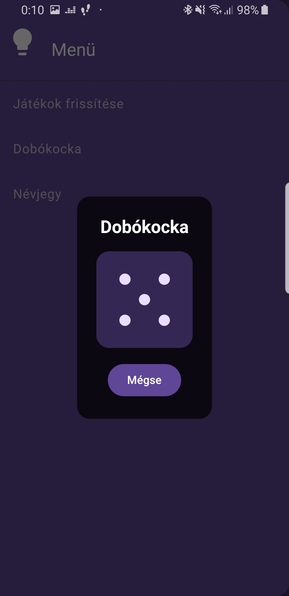
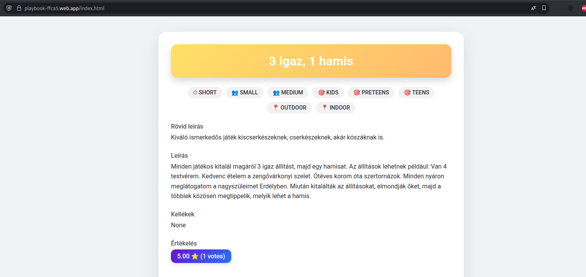

# Játékgyűjtemény

> ⚠️ **Figyelem:** Jelenleg még korlátozott az adatbázis tartalma!

## Rövid leírás
Ez egy könnyen kezelhető mobil és PC alkalmazás tervezet gyerekeknek és fiataloknak szervezett programokhoz.
Az alkalmazás célja, hogy gyorsan és egyszerűen hozzáférhető, szűrhető és frissíthető játékgyűjteményt biztosítson szervezők számára.

## Mire készült
- Gyors ötletadás játékszervezéshez (táborok, összejövetelek, programok).
- Szűrés korosztály, játékidő, helyszín (beltéri/kültéri) és eszközigény szerint.
- Egygombos véletlenszerű játékválasztás a döntés segítésére.
- Központi adatbázisról (Firebase) történő frissítés: a játékokat nem a felhasználók adják hozzá, hanem egy külön program tölti fel/karbantartja az adatbázist.

## Főbb funkciók
- Játéklista böngészése és részletes megtekintése (név, rövid/hosszú leírás, ajánlott korosztály, időtartam, hely, szükséges eszközök).
- Keresés és többparaméteres szűrés.
- Random játék generálása a beállított paraméterek alapján.
- Offline cache és frissítés Firebase-ről.

## Felhasználási útmutató - röviden
> ℹ️ **Információ:** Az alkalmazás egy hobbi projekt szint, így előfordulhatnak hibák vagy hiányosságok. Ha ilyet találsz, kérlek jelezd a fejlesztőnek!

### Telepítés és indítás
- Telepítés Androidon: Töltsd le az APK fájlt és telepítsd. (Később lehetséges a Play Áruház.)
- Telepítés PC-n: Futtasd a JAR fájlt Java környezetben.

### Kezdőlap
- Felső sáv: menü gomb, alkalmazás neve, keresősáv.
- Alul: rorrend fordító, random játék gomb, szűrő gomb.
- Középen: játéklista.
- A menü gombr akattintva nyílik meg a navigációs menü.
- A keresősáv segítségével gyorsan kereshetsz játékokat teljes vagy részleges név alapján.
- A sorrend fordítóval a játékok ABC sorrendjét lehet megfordítani (CBA), illetve ugyanígy vissza is.
- A random játék gomb megnyomásával a beállított szűrők alapján egy véletlenszerű játék kerül kiválasztásra és megjelenítésre.
- A szűrő gomb megnyomásával megnyílik a szűrő panel, ahol több paraméter alapján lehet szűrni a játékokat (korosztály, időtartam, helyszín, eszközigény).
- A korábban beállított szűrők mentésre kerülnek, így a következő indításkor is érvényesek lesznek.
- Indikátor jelzi, hogy van-e aktív szűrő.

### Játéklista
- A játéklista a kezdőlapon található, ahol a szűrők és keresés alapján megjelennek a találatok.
- A játékok neve, rövid leírása látható, emellett az ikon jelzi a játékidőt, míg a szín a korosztályt.
- Van lehetőség a kedvencek közé menteni játékokat a szív ikonra kattintva.
- A játékokra kattintva megnyílik a részletes nézet.

### Részletes játék nézet
- Felül ikon jelzi a játékidőt, a háttérszíne a korosztályt.
- A szív jelöli, hoyg kedvenc-e a játék, ezt it is beállíthatjuk.
- A csillagokkal a játék globális kedveltsége látható, amit a felhasználók értékelése alapján számolunk.
- Buborékokban jelennek meg a játék jellemzői: helyszín, korosztályok, időtartam, stb.
- A szükséges eszközök külön mezőt kapnak.
- A játék leírása részletesen olvasható.
- A csillag gombbal megnyílik a értékelés panel, ahol a felhasználó adhat pontszámot a játékhoz, ez az értékelés hozzáadódik a globális értékeléshez.
- A felhasználó csak egyszer értékelhet egy játékot, utána eltűnik a gomb.
- A megosztás gombbal a játokot megoszthatjuk az ismert platformokon keresztül az ismerőseinkkel.

### Random játék
- A kezdőlapon található random játék gomb megnyomásával a beállított szűrők alapján egy véletlenszerű játék kerül kiválasztásra és megjelenítésre a részletes nézetben.
- Ez segít a döntésben, ha nem tudjuk, melyik játékot válasszuk.
- A megjelenített paraméterek hasonlóak a részletes játék nézethez.

### Menü
- A menü gomb megnyomásával nyílik meg a navigációs menü.
- Menü elemek:
  - Játékok frissítése: weben keresztül frissíti a játékok listáját az app.
  - Dobókocka: egy egyszerű dobókocka alkalmazás megnyitása, gombnyomásra dob.
  - Névjegy: az alkalmazás fejlesztőiről és a projektről tartalmaz információkat.

### Nyelv és téma
- Az alkalmazáshoz angol, német és magyar nyelv érhető el.
- A nyelvet automatikusan a rendszer nyelvéhez igazítja az alkalmazás.
- Sötét és világos téma is elérhető, a rendszer beállításai szerint vált automatikusan.

### Megosztás
- A játékokat megoszthatod ismerőseiddel, ekkor egy linket küld a rendszer a megadott címzettnek.
- A linket megnyitva böngészőben megjelenik a játék részletes leírása.
- Nem kell exra alkalmazás a megtekintéshez.

### Új játék hozzáadása
- Ez a funkció csak JVM környezetben érhető el (PC alkalmazás).
- A menüből elérhető "Új játék hozzáadása" opcióval megnyílik egy űrlap.
- Az űrlapon megadhatók a játék adatai: név, rövid és hosszú leírás, korosztály, időtartam, helyszín, szükséges eszközök.
- Az űrlap kitöltése után a "Mentés" gombbal a játék adatai feltöltődnek a Firebase adatbázisba.
- Csak érvényes adatokkal lehet menteni, a rendszer jelzi a hibákat.
- Sikeres mentés után a játék megjelenik a központi adatbázisban és elérhetővé válik a kliens alkalmazások számára is.
- A JVM alkalmazásból elérhető törlés és módosítás funkció is.

- jelenleg ezt a funkciót csak a fejlesztők használhatják a játékok karbantartására, ha szükséges, akkor őket keresd!

---

## Készült
- Budapesti Műszaki és Gazdaságtudományi Egyetem - BME
- Villamosmérnöki és Informatikai Kar - VIK
- Automatizálási és Alkalmazott Informatikai Tanszék - AUT
- MSc Mérnök informatikus szak
- Önálló laboratórium 2
- 2025-2026/1 félév
- Fejlesztő: Erős Pál

## Műszaki részletek
- Platform: Kotlin Multiplatform (Android és PC alkalmazás).
- Backend/adat: Firebase (FireStore , a feltöltő eszköz a játékok karbantartásához).
- Nyelvek és eszközök: Kotlin, Gradle, AndroidStudio.
- Cél: egyszerű, reszponzív és modern UI.

## Telepítés és futtatás (rövid)

  
Felhasználóknak

  - Androidon: Töltsd le az APK fájlt és telepítsd.
  - PC-n: Futtasd a JAR fájlt Java környezetben.

  
Fejlesztőknek

  - Klónozd a repót: `git clone https://github.com/paleros/Playbook.git`
  - Nyisd meg Android Studio / IntelliJ-ben.
  - Állítsd be a `google-services.json` fájlt a megfelelő Firebase projekt adataival.
  - Futtasd a kívánt modul build konfigurációját (Android vagy JVM).

## Adatkezelés
- A játékok központilag kerülnek feltöltésre egy szerveres/asztali feltöltő programmal a Firebase adatbázisba.
- A mobil/PC kliens lekéri és cache-eli az adatokat, a felhasználó csak böngészi és szűri a listát.

## Fejlesztési megjegyzések
- A projekt célja a Kotlin Multiplatform megismerése és alkalmazása, valamint Firebase integráció gyakorlása.
- Fontos részek: offline támogatás, gyors szűrés és letisztult modern felhasználói felület.